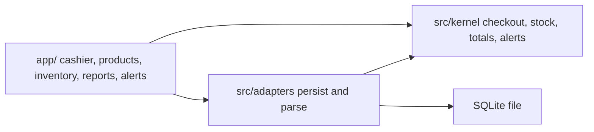

# Module map

v1 is three layers. Nothing else.

```
app/                 Next.js UI and route handlers
src/adapters/        SQLite (or Postgres) and Zod parsers
src/kernel/          domain types and pure functions
```

`app/` may import adapters and kernel. Adapters may import kernel. Kernel imports neither.



## Kernel (`src/kernel`)

| File | Owns | Public functions | Must not import |
| --- | --- | --- | --- |
| `money.ts` | `Centavos`, add/sum, format as peso | `centavos`, `add`, `times`, `sum`, `formatPhp` | React, Next, SQL |
| `types.ts` | Ids, `Product`, `Catalog`, `CompletedSale`, commands, results | types only | React, Next, SQL |
| `catalog.ts` | Search, grid, upsert | `searchProducts`, `frequentGrid`, `upsertProduct`, `buildCatalog` | React, Next, SQL |
| `checkout.ts` | Quote and complete sale | `quoteBasket`, `checkout` | React, Next, SQL |
| `inventory.ts` | Stock in | `receiveStock` | React, Next, SQL |
| `reports.ts` | Period totals | `salesTotals` | React, Next, SQL |
| `alerts.ts` | Derived warnings | `stockAlerts` | React, Next, SQL |
| `index.ts` | Re-export the functions above | that list | React, Next, SQL |

`checkout` updates catalog counts and the sales book in the value it returns. It does not call `receiveStock`. `stockAlerts` and `salesTotals` read. They do not write.

There is no `validateSale.ts`, `saveSale.ts`, or `transformSale.ts`. Validation of wire input lives in the adapter. Decision lives in `checkout`.

## Adapters (`src/adapters`, not implemented in this PR)

- `db.ts` — load catalog and sales, persist a checkout or receive in one transaction, unique on `commandId`
- `parse.ts` — Zod schemas for forms and route bodies. Output is kernel types. Prisma or SQL rows do not leak into `app/`

## UI (`app/`, not implemented in this PR)

| Route | Job |
| --- | --- |
| `/` | Cashier: grid, search, basket, confirm |
| `/products` | List, search, create, edit price and `lowStockAt` |
| `/inventory` | Counts and receive |
| `/reports` | Day, month, year totals |
| `/alerts` | Low stock and not moving |

The cashier may also badge the alerts route. That is UI, not a fifth kernel.

## Deliberate absences

No `customers` module. No `payments` module. No `events` module. No `sync` module. Those wait on [later-features.md](later-features.md).
